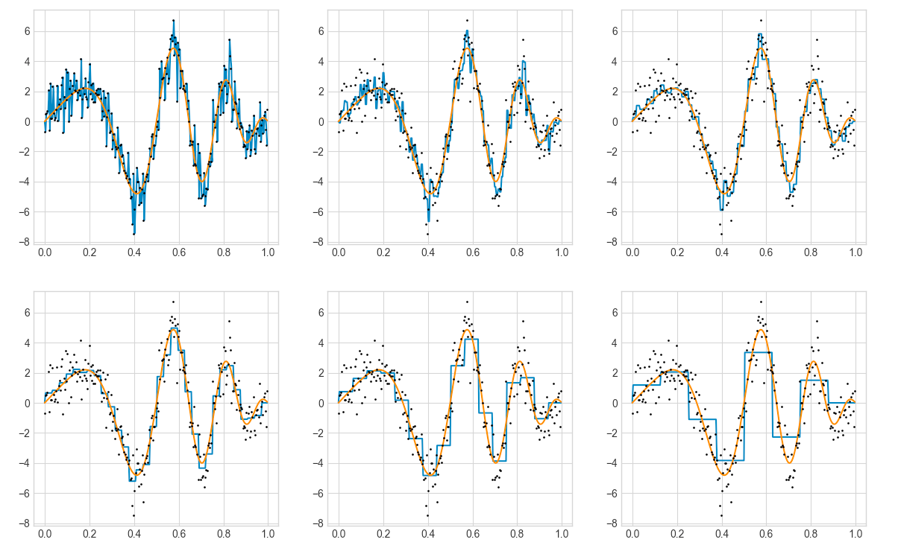

# 546_materials

This repo exists to save the class materials from University of Washington's CSE 546: Machine Learning course. I often return to these materials for clear and fast review of fundamental ML algorithms.

Every pdf or html was obtained by downloading from the [course site](https://courses.cs.washington.edu/courses/cse446/21sp/).
None of the files belong to me...

Except this figure illustrating how to overfit (blue) data (orange)!

